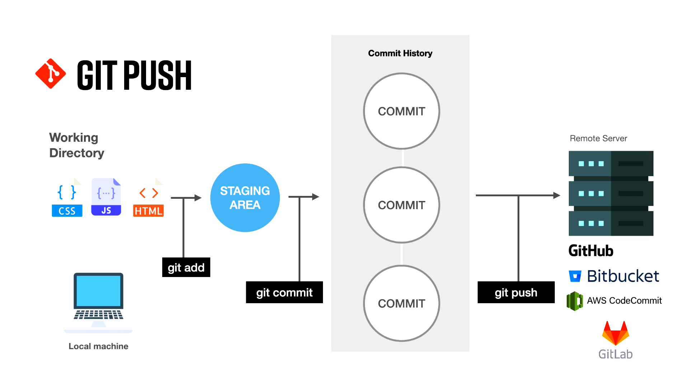
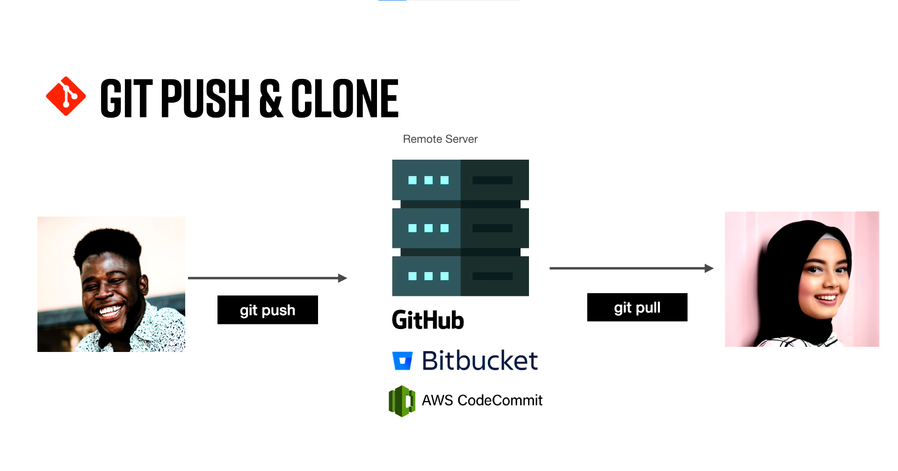
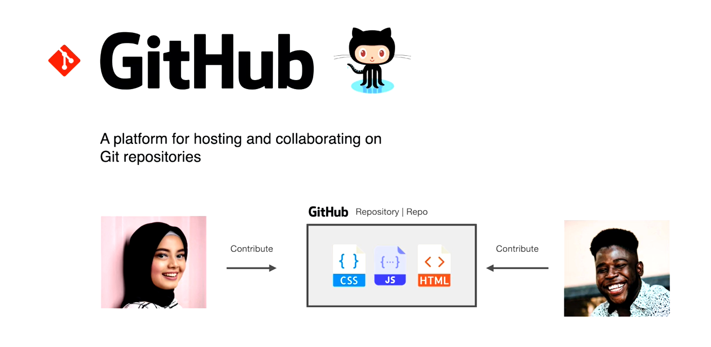
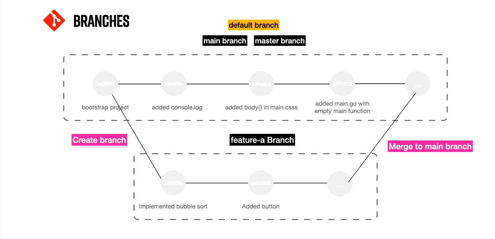

# Git and Github: Beginners

- [Git and Github: Beginners](#git-and-github-beginners)
  - [Git](#git)
    - [What is Git?](#what-is-git)
    - [What is Github?](#what-is-github)
    - [How Git Works?](#how-git-works)
    - [Git Installation](#git-installation)
    - [Configure Git](#configure-git)
    - [Initialising Git Repository](#initialising-git-repository)
    - [Git Add](#git-add)
    - [Git Commit](#git-commit)
    - [Amend commit messages](#amend-commit-messages)
  - [Git and Github](#git-and-github)
    - [Creating a Github Repo and adding SSH key](#creating-a-github-repo-and-adding-ssh-key)
    - [Git Pull](#git-pull)
    - [Branches](#branches)
  - [Merging and Pull Requests](#merging-and-pull-requests)
  - [Conflicts](#conflicts)
  - [Rebase](#rebase)

## Git

### What is Git?

> Git is a version control system that allows different people to work on the same codebase.

### What is Github?

> Github is a hosting platform that allows storage of our codebase somewhere in the cloud. It's a platform for hosting and collaborating on Git repositories.

### How Git Works?

### Git Installation

[Installation Guide (github.com)](https://github.com/git-guides/install-git)

- check git installation `git --version` or `git --help`

### Configure Git

- `git config --global user.name "username"`
- `git config --global user.email "hello@username.com`
- `git config --global color.ui auto`

### Initialising Git Repository

- `mkdir learning-git` and `cd learning-git`
- initialize empty git repository `git init .`

### Git Add

- `touch index.html` `touch main.jss` `touch main.css`
- `git status` gives status of changes we have made
- `git add index.html`
- `git rm --cached index.html` to unstage the change we have made
- `git add .` to add all the files and folders in the current directory to the staging area
- `git rm -r --cached .` to recursively remove all the files and folders from the staging area
- `git add -A` to add all files and folders irrespective of the current directory to the staging area

### Git Commit

- `git commit -m 'bootstrap project'` to commit the staged files
- `git log` to see the changes and all the commits that have been made previously
- `git show paste-the-hash-here` to see specific commit using that commit's hash
- `git diff` to show the changes made after the latest commit
- `git restore` to revert back to the latest commit discarded any changes made after that

### Amend commit messages

- `git commit --amend -m 'new message'`

## Git and Github

### Creating a Github Repo and adding SSH key

- create a repo using the Githib GUI
- add the remote branch using `git remote add origin name-git`
- create a new ssh key using [manual](https://docs.github.com/en/github/authenticating-to-github/connecting-to-github-with-ssh)
- add the new ssh key to github account
- `git push -u origin master` to push your code into master branch

### Git Pull

- to fetch the lastest changes from the remote master/main branch
- execute `git pull`

### Branches

- main and master are basically the same branch
- a branch represents an independent line of development
- create a different branch if you want to contribute to an open-source and merge it the main branch
- to know about your branch `git branch`
- to know remote branch `git branch -r`
- to know all branch `git branch -a`
- creating a new branch `git branch name-of-the-branch`
- switch to different branch `git branch name-of-the-branch`
- switch to the previous branch `git branch -`
- creating a new branch and entering into it `git checkout -b to-delete`
- delete a branch `git branch -d to-delete`

## Merging and Pull Requests

- you create a branch and make some changes
- you commit that branch and push it to remote repository
- make a pull request and let someone review all the changes and merge it to the master branch
- for local merge `git merge feature-branch` from master branch
- for getting the flow of commits `git log --oneline`

## Conflicts

- make changes to the feature branch
- simultaneously make changes on the another machine and push it to the remote
- try to push your changes to the remote, it will fail
- `git pull` all the current changes from the remote
- resolve the conflicts using an editor
- stage all the changes, commit and push it to remote

## Rebase

- it will push all the updated commits from main/master branch like in a stack
- on top of that your changes will be squashed
- use `git pull --rebase origin master`
- resolve all the conflicts
- `git add .` and `git rebase --continue`
- forcefully push `git push -f`
- try to squash and commit in the merge process on Github
